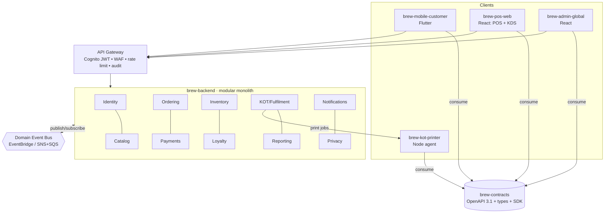

# Architecture Overview — Project Brew

API-first, event-driven café operations platform. **Launches as a modular
monolith** (NestJS) whose modules are designed to be extracted into independent
services without rework. AWS-native (Cognito mandated).

## Tenancy / hierarchy

```
Organization → Region → Store → Station (Bar | Hot Kitchen | Cold | Bakery)
```

All transactional data is **scoped to a store**; reporting rolls up the hierarchy.
Multi-store / multi-region is live from day one.

## Component map



## Domain event catalog

| Event | Producer | Consumers |
| --- | --- | --- |
| `order.placed` | Ordering | Inventory (deduct), KOT (print), Reporting |
| `payment.captured` | Payments | Loyalty (accrue), Reporting |
| `payment.refunded` | Payments | Loyalty, Reporting |
| `inventory.deducted` | Inventory | Reporting |
| `kot.print_requested` | KOT | Print agent |
| `order.ready` | Ordering/KOT | Notifications, customer app |
| `order.picked_up` | Ordering | Reporting |
| `loyalty.accrued` | Loyalty | Notifications |
| `privacy.consent_changed` | Privacy | Notifications (marketing gate) |

## Demo flow (§12)

`seed org→store→menu/recipe` → app pre-order (`order.placed`) →
inventory deduct + KOT print → Razorpay UPI pay → webhook (`payment.captured`) →
loyalty accrues + tier recompute → KDS bump (`order.ready`) → notify → sale in reporting
with profit & unit economics.

This vertical slice is **executable end-to-end** against the mock adapters and is
asserted by `apps/brew-backend/src/demo-flow.e2e-spec.ts` (order pricing + GST split,
payment idempotency, webhook signature check, loyalty accrual, KOT/KDS, mark-ready,
and recognised revenue in reporting). Run it with `pnpm --filter brew-backend test`.

## Why modular monolith now

Single deployable, single language (TypeScript) end-to-end, clean module
boundaries (own schema + events). Extraction to microservices later is a
deployment change, not a redesign. See `docs/adr/0001`.
